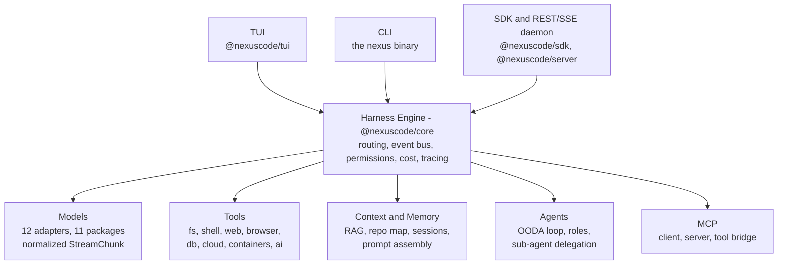

# NexusCode

**One AI coding CLI for every provider.** NexusCode is a provider-agnostic AI harness: a single `nexus` command, a single engine, and a swappable set of model backends — OpenAI, Anthropic, Gemini, Bedrock, Vertex, Azure, Ollama, or a wrapped Claude Code / Codex CLI. Every run streams, every run is priced, and every run is recorded.


> **Project status — read this first.** NexusCode is at **v0.1.0**, its first public release. The engine is real and well tested (1731 tests across 166 files, all passing), but this is a young project: the CLI surface, the config schema, and the SDK types **may change without a deprecation cycle** until 1.0. It is **not yet published to npm** — install from source (below).

---

## What it is, and why it exists

Every vendor now ships its own coding CLI, and each one locks you into one model, one pricing page, one prompt format, and one session store. NexusCode is the layer underneath that:

- **One CLI over many providers.** `nexus ask -p openai` and `nexus ask -p anthropic` are the same command with the same flags, the same streaming output, and the same JSON shape. Switching providers is a flag, not a rewrite.
- **A normalized stream.** Every adapter — native SDK or wrapped subprocess CLI — is normalized into one `StreamChunk` union: text deltas, tool calls, file edits, usage, errors. The TUI, the CLI renderer, the SDK, and the REST daemon all consume that one stream.
- **Cost accounting that is always on.** Token counts and USD cost are computed per run from a pricing table and written to a local SQLite history. `nexus usage` reports it; `nexus budget` caps it.
- **A real agentic tool loop.** Filesystem, shell, web, browser, database, cloud, and container tools behind a permission gate (read-only by default, `--approve` / `--yolo` to widen). Optionally the full OODA loop — observe, reason, plan, act, evaluate — with specialized roles.
- **Multi-provider orchestration as first-class commands.** Fan one prompt across providers (`compare`), race them (`race`), reconcile them through a judge (`consensus`), or pipe them through stages (`chain`).
- **Context that persists.** A local RAG index with citations, an aider-style PageRank repo map, durable memory, and branchable sessions you can replay or export.
- **MCP in both directions.** Consume Model Context Protocol servers as tools, and expose the engine's own tools over MCP.
- **Everything is local.** SQLite history, file-backed indexes, secrets in the OS keychain. The REST daemon binds to loopback and requires a bearer token. No telemetry.

It works with **zero API keys** — the built-in `mock` provider is a deterministic offline model, so you can exercise the entire surface before signing up for anything.

---

## Feature highlights

| Area | What you get |
|---|---|
| **Providers** | 12 adapters covering OpenAI, Anthropic, Gemini, Vertex, Bedrock, Azure OpenAI, Ollama, Grok, Claude Code, Codex, a deterministic mock, and a generic OpenAI-compatible transport — which in turn unlocks Groq, Together, DeepSeek, Mistral, OpenRouter, NVIDIA, LM Studio, and vLLM |
| **Auth** | Real OAuth 2.0 + PKCE browser flows, device-code flows, vendor-CLI delegation, cloud SSO, and guided API-key capture — tokens in the OS keychain, never printed |
| **Routing** | Pick a provider by `cost`, `latency`, `quality`, `local`, or explicit rules, with live failover; `nexus route explain` shows the decision before you spend anything |
| **Orchestration** | `compare`, `race --mode first\|best`, `consensus --strategy rank\|vote\|merge`, `chain --stages` |
| **Agents** | Native tool loop, or the OODA framework with `coder`, `reviewer`, `tester`, `planner`, `researcher`, `architect`, `doc-writer`, `security-reviewer`, `coordinator` roles |
| **Tools** | fs, shell, web search/fetch/crawl, Playwright browser, SQL databases, AWS/Azure/GCP read APIs, Docker/Kubernetes inspection, vision/OCR/image-gen/TTS/STT — each with a permission class, heavy integrations lazily loaded |
| **Context** | RAG index with citations, incremental `--watch` indexing, PageRank repo map, symbol/xref indexing, durable memory tiers |
| **Code intelligence** | LSP client: goto-definition, find-references, diagnostics, hover, rename — degrades cleanly when no language server is installed |
| **Git** | Conventional Commit generation, diff review, plain-language diff explanation, PR title + description |
| **TUI** | Ink-based pane-tree UI, 16 themes, 5 layout presets, falls back to linear output on a non-TTY |
| **Sessions** | Event-log-backed sessions: list, show, rename, branch, delete, export (json/md/html), replay, and a self-contained local Code Receipt |
| **Observability** | OpenTelemetry-shaped spans, TTFT/latency/token/cost metrics, NDJSON + OTLP exporters, `nexus trace` Gantt timeline |
| **Extensibility** | Embeddable SDK, REST + SSE daemon, MCP client/server, lifecycle hooks, HMAC-signed webhooks, sandboxed plugins |
| **Enterprise** | RBAC, deny-overrides policy engine, hash-chained tamper-evident audit log, budgets, usage analytics — all offline, no external IdP |

---

## Install

> **NexusCode is not published to npm yet.** `npm install -g @nexuscode/cli` will **not** work. Publishing is planned but not available for v0.1.0. Install from source:

```bash
git clone https://github.com/Adhithya-Karthikeyan/NexusCode.git
cd NexusCode
npm install
npm run build
```

Requires **Node.js >= 20.11**. The build compiles all 44 workspace packages in dependency order and takes a couple of minutes on a first run.

### Putting `nexus` on your PATH

Link the CLI workspace globally:

```bash
npm link --workspace=@nexuscode/cli
nexus --help
```

That symlinks the `nexus` binary into your global npm prefix. Undo it later with `npm unlink -g @nexuscode/cli`.

`nexus` is the only binary NexusCode installs — nothing else on your `PATH` is touched.

**Prefer not to touch your global npm prefix?** Run the built entry point directly:

```bash
node packages/cli/dist/index.js ask -p mock "hello"
```

Or alias it. Run this from the repo root so `$PWD` expands to your clone, then add the resulting line to your shell profile:

```bash
alias nexus="node $PWD/packages/cli/dist/index.js"
```

The rest of this README writes `nexus`; substitute whichever form you chose.

---

## Quick start (no API key required)

The `mock` provider is a real, registered adapter that streams deterministic output with zero network and zero credentials. Everything below runs on a fresh clone:

```bash
# 1. A one-shot completion
nexus ask -p mock "what is 2+2?"
#   [mock-fast] Echo: what is 2+2?
#   [usage] mock:mock-fast in=3 out=8 cost=$0.000000 finish=stop
#   [trace] ttft=0ms latency=1ms spans=2

# 2. The same thing as machine-readable JSON
nexus ask -p mock -o json "hi" | jq .

# 3. Two providers side by side
nexus compare -b mock -b mock:mock-smart "hi"

# 4. An agentic run with the native tool loop
nexus agent -p mock -m mock-tools "read the config"

# 5. Check what's installed and what's healthy
nexus doctor
nexus providers list
nexus models mock

# 6. The interactive terminal UI
nexus tui --theme nexus-noir
```

### Then connect a real provider

`nexus login` runs each provider's genuine auth flow and stores tokens in the OS keychain — it never prints them.

```bash
nexus login                    # interactive picker
nexus login openai             # guided API-key capture
nexus login anthropic --api-key  # stable console key (recommended for Claude)
nexus login gemini --device    # headless device-code flow

nexus auth status              # who is signed in, by what method, expiring when
```

Already have the Claude Code or Codex CLI installed and logged in? NexusCode can drive it as a provider with no separate login at all:

```bash
nexus ask -p claude-code "explain this repo's routing"
```

Then make it the default:

```bash
nexus config set defaultProvider anthropic
nexus ask "explain type inference"
```

New to the project? [docs/GETTING-STARTED.md](docs/GETTING-STARTED.md) walks the same path in more detail.

---

## Command reference

All **44 commands**, one line each. Global flags shared by most commands: `-p/--provider`, `-m/--model`, `-o/--output text|json|ndjson`, `-s/--system`.

**➡️ Full flags, subcommands, and exit codes for every command: [docs/COMMANDS.md](docs/COMMANDS.md)**

### Run a model

| Command | What it does |
|---|---|
| `tui` | Launch the rich interactive terminal UI with `--theme`/`--preset` (falls back to linear on a non-TTY). |
| `ask` | One-shot completion. Reads stdin when no prompt is given. |
| `agent` | Agentic run: native tool loop, or the full OODA framework with `--role`. |
| `chat` | Headless line REPL over the engine. |
| `code` | Drive a subprocess coding CLI (claude-code / codex) through the engine. |
| `plan` | Turn an objective into a verifiable, dependency-ordered task plan (planner role). |

### Multi-provider orchestration

| Command | What it does |
|---|---|
| `compare` | Fan a prompt out across `-b` providers. |
| `race` | Race `-b` providers; `--mode first` (fastest ok, cancels losers) or `best` (judge-ranked). |
| `consensus` | Fan across `-b` providers, then reconcile them into one answer via a judge. |
| `chain` | Run staged with hand-offs. Default preset plan→edit→review over mock; override with `--stages`. |
| `route` | Show (`explain`) or exercise (`test`) which provider a RouteRule picks, with live failover. |

### Providers, models, and auth

| Command | What it does |
|---|---|
| `providers` | List or add providers. |
| `models` | List the models for one provider — live from the provider, with a curated fallback. |
| `login` | Sign in to a provider with its real auth flow (browser OAuth / device code / vendor CLI / guided key). |
| `logout` | Sign out of a provider (clear stored tokens); `--all` for every provider. |
| `auth` | Show per-provider sign-in state: logged in?, method (oauth/api-key/cli/cloud-sso), token expiry. |
| `keys` | Manage secrets (values always masked). Prefer `nexus login`. |

### Code and git

| Command | What it does |
|---|---|
| `commit` | Generate a Conventional Commit message from the staged diff (`--approve` applies it). |
| `review` | Review the current git diff (supports `git diff \| nexus review`). |
| `explain` | Explain a diff in plain language (supports `git diff \| nexus explain`). |
| `pr` | Generate a PR title + description from commits/diff (`--base <ref>` to scope). |
| `lsp` | Code intelligence over LSP: definition, references, diagnostics, hover, rename. |

### Context, memory, and search

| Command | What it does |
|---|---|
| `index` | Build the RAG index + repo map for a project directory (`--watch` incremental, `--background` detached). |
| `search` | Query the RAG index and show cited chunks. |
| `memory` | Inspect and edit durable memory. |
| `cache` | Inspect (`stats`) or clear the response/embedding caches. |

### Tools and extensions

| Command | What it does |
|---|---|
| `tools` | List registered tools (grouped, with permission + integration availability) or run one directly. |
| `mcp` | Declare, list, remove, and discover tools from MCP servers. |
| `plugin` | Manage engine-extending plugins: list, add, remove, info. |
| `jobs` | Terminal integration: list, run, history, pty (background jobs + command history). |

### Tasks

| Command | What it does |
|---|---|
| `task` | Manage the durable task plan: list, add, start, done, block, cancel, rm, show, clear. |

### Sessions, history, and observability

| Command | What it does |
|---|---|
| `session` | Manage sessions over the event log: list, show, rename, branch, delete, export. |
| `history` | Inspect the SQLite run timeline. |
| `replay` | Re-render a recorded session's timeline (text; `--output ndjson` feeds a TUI). |
| `receipt` | Generate the private, redaction-safe Code Receipt (local HTML) for a session. |
| `trace` | Show the span timeline (Gantt) for a run/session/trace from the trace sink. |
| `doctor` | Verify providers/keys/pipeline health. |

### Configuration and serving

| Command | What it does |
|---|---|
| `config` | Read/write configuration (`get`, `set`, `path`). |
| `serve` | Start the REST + SSE daemon (`@nexuscode/server`) over the same engine. |

### Enterprise

All offline, no external identity provider. See [docs/COMMANDS.md](docs/COMMANDS.md).

| Command | What it does |
|---|---|
| `rbac` | List roles/grants/principals, or check a permission (fail-closed authorizer). |
| `policy` | List deny-overrides policy rules, or test one. |
| `audit` | Query the append-only, hash-chained audit log or verify its integrity. |
| `budget` | Show budgets + live spend, or set a budget. |
| `usage` | Cost/token analytics over the run history, with CSV/JSON export. |

---

## Usage examples

Every example below is taken from the CLI's own verified help output.

**One-shot and streaming**

```bash
nexus ask "write a hello function in rust"
git diff | nexus review
nexus ask -o ndjson "hello"          # newline-delimited events for scripting
```

**Agentic work**

```bash
nexus agent -p mock -m mock-tools 'read the config'
nexus agent --role coder --max-steps 4 -p mock -m mock-tools 'add a hello function'
nexus plan -p mock -m mock-tools 'build a login page'
```

Permission is read-only by default; widen it explicitly with `--approve` (workspace-write, auto-approve exec/network) or `--yolo` (full access).

**Multi-provider**

```bash
nexus compare -b mock -b mock:mock-smart "hi"
nexus race -b mock -b mock:mock-smart hi              # fastest healthy answer
nexus race --mode best -b mock -b mock:mock-smart hi  # judge-ranked
nexus consensus -b mock -b mock:mock-smart hi
nexus chain --stages mock:mock-fast,mock:mock-smart 'plan then write'
nexus route explain --optimize cost
```

**Git workflow**

```bash
nexus commit                 # draft a Conventional Commit from the staged diff
nexus commit --approve       # draft it and apply it
nexus pr --base main
git diff main...HEAD | nexus pr
```

**RAG and code intelligence**

```bash
nexus index ./src
nexus index --watch                                   # incremental
nexus search 'how does routing work'
nexus lsp definition src/index.ts --line 10 --character 4
nexus lsp diagnostics src/index.ts
```

**Tools and MCP**

```bash
nexus tools list
nexus tools run web_fetch --approve --args '{"url":"https://example.com"}'
nexus mcp add fs --transport stdio --command npx --args -y --args @modelcontextprotocol/server-filesystem
nexus mcp tools
nexus mcp call kyp-mem kyp_stats
```

**Serve the engine over HTTP**

```bash
nexus serve --port 8787
```

Embeds one `@nexuscode/sdk` instance and serves it over HTTP + Server-Sent Events. Bearer-token auth on every data route, bound to `127.0.0.1` by default, `GET /v1/health` public. Prints the URL and token on startup.

**Sessions and receipts**

```bash
nexus session list
nexus session export <id> --format html -o session.html
nexus session branch <id> --name experiment
nexus receipt <sessionId> -o ./receipt.html
nexus trace <sessionId>
```

**Enterprise**

```bash
nexus rbac check --principal alice --action write --resource tool:fs_write
nexus policy test --principal bob --action use --resource model:gpt-4o --cost 2.50
nexus usage --window month --format csv
nexus audit --verify
nexus budget set --id org-cap --scope org --key acme --limit 500 --window month
```

---

## Architecture

NexusCode is a **microkernel**. `@nexuscode/core` owns lifecycle, routing, the event bus, permissions, cost, and tracing — and knows nothing about any specific provider. Everything else plugs into it behind frozen contracts, and every front end (CLI, TUI, SDK, REST daemon) is a *client* of the same single engine.



**Layer rules, enforced by the dependency graph:**

- `shared` ← `config` ← `core` ← `tools`, `providers/*` ← `cli`
- Providers never import the CLI. Core never imports a provider — adapters are loaded through variable dynamic `import()`, so a missing or broken provider package degrades to an "unavailable" status instead of crashing the process.
- Heavy subsystems (RAG index, LSP servers, `tools-*` groups, the REST server) are registered as lazy factories and built only on first use, so a one-shot `nexus ask` never spins up an index it will not read.

**Full layer diagrams, data flow, and the frozen contracts: [docs/ARCHITECTURE.md](docs/ARCHITECTURE.md)**

---

## Providers

**12 provider adapters**, shipped across 11 packages under `packages/providers/` — the OpenAI package carries three of them (its native adapter, a ready xAI Grok config, and the generic OpenAI-compatible transport). Run `nexus providers list` to see which are registered and credentialed on your machine, and `nexus auth status` for sign-in state.

| Provider id | Package | Credentials |
|---|---|---|
| `mock`, `mock-flaky`, `mock-slow` | `provider-mock` | **None** — deterministic, offline, zero network |
| `openai` | `provider-openai` | `OPENAI_API_KEY` (or `nexus login openai`) |
| `grok` | `provider-openai` | xAI credential via config or the SecretStore |
| *any OpenAI-compatible endpoint* | `provider-openai` | Declare `kind: "openai-compat"` + a `baseUrl` |
| `anthropic` | `provider-anthropic` | OAuth browser flow *(experimental)* or `ANTHROPIC_API_KEY` |
| `gemini` | `provider-gemini` | `GEMINI_API_KEY` / `GOOGLE_API_KEY`, or device-code login |
| `vertex` | `provider-vertex` | GCP Application Default Credentials |
| `bedrock` | `provider-bedrock` | AWS credential chain (`AWS_PROFILE`, `~/.aws`, env, IRSA) |
| `azure-openai` | `provider-azure` | `AZURE_OPENAI_API_KEY` + endpoint |
| `ollama` | `provider-ollama` | **None** — local server |
| `claude-code` | `provider-claude-code` | Reuses an existing `claude` CLI session |
| `codex` | `provider-codex` | Reuses an existing `codex` CLI session |
| *(shared base)* | `provider-subprocess` | Base adapter for the two subprocess CLIs above |

The OpenAI-compatible transport in `provider-openai` covers a lot more without a new adapter. These presets are registered out of the box and appear in `nexus providers list`:

**Groq** (`GROQ_API_KEY`) · **Together** (`TOGETHER_API_KEY`) · **DeepSeek** (`DEEPSEEK_API_KEY`) · **Mistral** (`MISTRAL_API_KEY`) · **OpenRouter** (`OPENROUTER_API_KEY`) · **NVIDIA** (`NVIDIA_API_KEY`) · **LM Studio** and **vLLM** (local, no key needed)

A ready **xAI Grok** config ships in the same package (`grokCompatConfig` / `createGrokAdapter`, pointed at `https://api.x.ai/v1`); supply its credential through config or the SecretStore. Any other OpenAI-compatible endpoint works by declaring a provider with `kind: "openai-compat"` and a `baseUrl` — see [docs/PROVIDERS.md](docs/PROVIDERS.md).

**Per-provider setup, model maps, and auth details: [docs/PROVIDERS.md](docs/PROVIDERS.md)**

---

## Configuration

Config is merged low-to-high across five layers — **built-in defaults → user config → project config → `NEXUS_*` env vars → CLI flags**. Arrays replace rather than concatenate, so a project can fully override routing.

Provider **key values never enter this cascade**. Secrets resolve separately through the SecretStore chain (env → OS keychain → encrypted file), and config only ever holds a logical `apiKeyRef` / `apiKeyEnv`.

```bash
nexus config path                        # where your user config lives (platform-specific)
nexus config get defaultProvider
nexus config set defaultProvider anthropic
nexus config set cache.enabled true
```

A project-level config is picked up from `nexuscode.config.*`, `package.json#nexuscode`, or `.nexusrc` in the working directory.

Useful environment variables (all real, all optional): `NEXUS_DEFAULT_PROVIDER`, `NEXUS_DEFAULT_MODEL`, `NEXUS_CONFIG_DIR`, `NEXUS_DATA_DIR`, `NEXUS_CACHE_DIR`, `NEXUS_HISTORY_DB`, `NEXUS_HISTORY_DISABLED`, `NEXUS_TRACE_FILE`, `NEXUS_PLUGINS_DIR`, `NEXUS_APPROVAL`, `NEXUS_CLAUDE_CODE_BIN`, `NEXUS_CODEX_BIN`, `NEXUS_PLAIN`, `NEXUS_COLOR`.

**Every key, default, and precedence rule: [docs/CONFIGURATION.md](docs/CONFIGURATION.md)**

---

## Documentation

| Document | What's in it |
|---|---|
| [docs/README.md](docs/README.md) | Documentation index and reading order |
| [docs/GETTING-STARTED.md](docs/GETTING-STARTED.md) | Install, first run, connecting a provider, first agentic task |
| [docs/COMMANDS.md](docs/COMMANDS.md) | Complete reference for all 44 commands — every flag, subcommand, and example |
| [docs/CONFIGURATION.md](docs/CONFIGURATION.md) | Config schema, precedence, secrets, and environment variables |
| [docs/PROVIDERS.md](docs/PROVIDERS.md) | Per-provider setup, authentication flows, and model maps |
| [docs/ARCHITECTURE.md](docs/ARCHITECTURE.md) | Layer diagrams, engine internals, frozen contracts, data flow |

---

## Development

```bash
git clone https://github.com/Adhithya-Karthikeyan/NexusCode.git
cd NexusCode
npm install

npm run build       # build all 44 packages in dependency order
npm test            # vitest, whole workspace (1731 tests / 166 files)
npm run typecheck   # tsc --noEmit across every workspace
npm run clean       # remove dist/ and coverage/ everywhere
npm run test:watch  # vitest in watch mode
```

npm workspaces, TypeScript, ESM throughout, built with [tsup](https://tsup.egoist.dev), tested with [vitest](https://vitest.dev). To run a single package's tests:

```bash
npx vitest run packages/core
```

### Repository layout

```
packages/
  shared/            zero-dependency contracts + zod schemas
  config/            config loading (cosmiconfig + zod) + SecretStore chain
  core/              the harness engine: adapters, registry, router, event bus
  runtime/           bootstrap — config in, live registry + secrets + pricing out
  auth/              OAuth 2.0 PKCE + device-code flows, token lifecycle
  cli/               the `nexus` binary (clipanion + clack)
  tui/               Ink/React renderer over the engine's UiEvent stream
  sdk/               embeddable SDK — one import to run the engine in-process
  server/            REST + SSE daemon (`nexus serve`)
  providers/
    mock/  openai/  anthropic/  gemini/  vertex/  bedrock/
    azure/  ollama/  subprocess/  claude-code/  codex/
  tools/             tool registry + execution surface (fs, shell)
  tools-web/         web_search, web_fetch, web_crawl (SSRF-guarded)
  tools-browser/     Playwright-backed browser tools (optional, lazy)
  tools-db/          db_query / db_schema over a driver seam (SQLite built in)
  tools-cloud/       read-oriented AWS / Azure / GCP resource inspection
  tools-containers/  read-oriented Docker / Kubernetes / OpenShift inspection
  tools-ai/          vision, OCR, image generation, TTS/STT
  agent/             OODA loop, reflection, replanning, role agents
  context/           context assembly: memory + tools + prompts → model context
  prompt/            prompt assembly and templating
  memory/            durable conversation/session memory
  rag/               embeddings, chunking, vector store, hybrid search, citations
  fileintel/         language detection, parsing seam, PageRank repo map
  lsp/               JSON-RPC LSP client with graceful degradation
  mcp/               MCP client, server, and tool bridge
  session/           sessions over the event log, replay, export, Code Receipt
  tasks/             task/subtask model, dependency DAG, durable store
  git/               git context + provider-driven explain/review/commit/PR
  cache/             prompt/response/embedding caches + savings accounting
  observability/     OTel-shaped tracer, metrics, exporters, trace store
  hooks/             lifecycle HookBus + HMAC-signed outbound webhooks
  plugins/           plugin manifest, discovery, sandboxed loading
  enterprise/        RBAC, policy, hash-chained audit log, budgets, usage
  theme/             pure token data + resolver for the signature palettes
```

---

## Contributing

Contributions are welcome, and early feedback is especially valuable at this stage. Before opening a pull request:

1. `npm run build && npm test && npm run typecheck` must all pass.
2. Add tests for behaviour you change — the suite is the contract.
3. Respect the layer rules: providers never import the CLI, core never imports a provider, and `shared` stays dependency-free.
4. Optional integrations (Playwright, database drivers, cloud SDKs) must stay **optional and lazily imported** — a missing one returns a clean error, never a crash.

Bug reports and feature requests: <https://github.com/Adhithya-Karthikeyan/NexusCode/issues>

## License

[MIT](LICENSE) © NexusCode contributors
