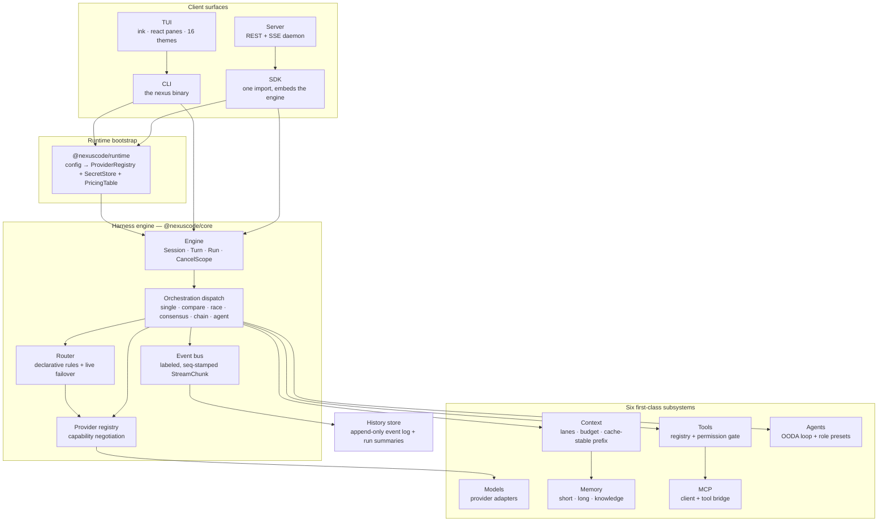
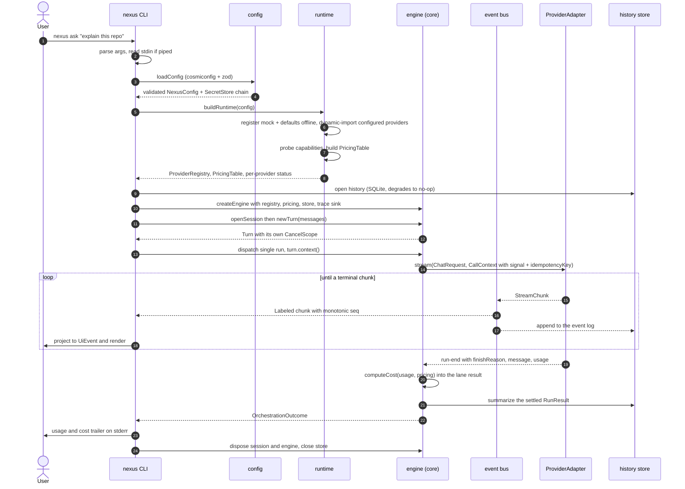
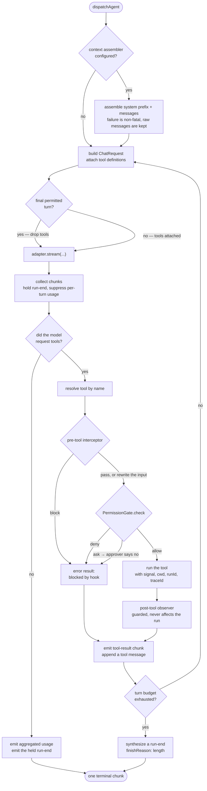
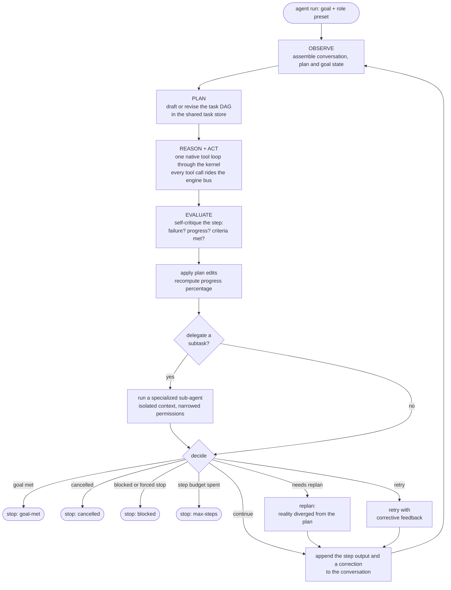
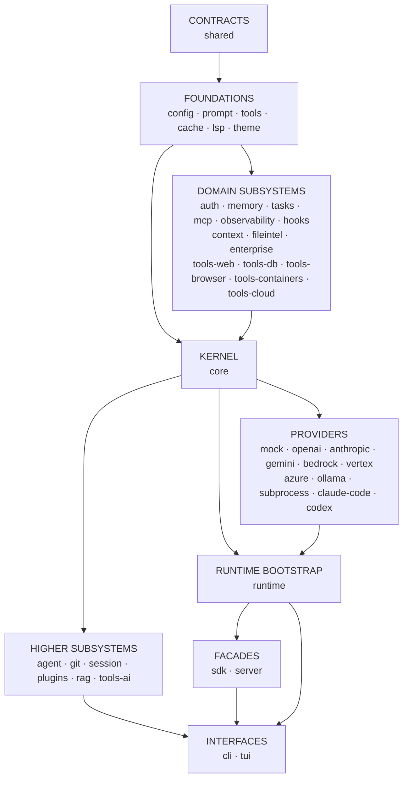

# NexusCode Architecture

NexusCode is a provider-agnostic AI CLI harness. One engine drives every surface — the `nexus` command line, the terminal UI, the embeddable SDK, and the local REST daemon — and every model backend, whether an HTTP SDK or a wrapped coding CLI, is reduced to the same streaming contract.

This document explains how that works: the layers, the contracts that bind them, the exact path a request takes, and where you plug in.

**Audience:** an engineer reading this repository for the first time.

---

## Table of contents

- [1. System overview](#1-system-overview)
- [2. The two frozen contracts](#2-the-two-frozen-contracts)
- [3. Request lifecycle: one `nexus ask`](#3-request-lifecycle-one-nexus-ask)
- [4. The agentic tool loop](#4-the-agentic-tool-loop)
- [5. The OODA agent loop](#5-the-ooda-agent-loop)
- [6. Multi-provider orchestration](#6-multi-provider-orchestration)
- [7. Context and memory pipeline](#7-context-and-memory-pipeline)
- [8. Package map](#8-package-map)
- [9. Key design decisions](#9-key-design-decisions)
- [10. Extension points](#10-extension-points)

---

## 1. System overview

Four client surfaces sit on one kernel. The kernel owns the session/turn/run lifecycle, orchestration, routing, the event bus, and the provider registry. Below it sit six first-class subsystems that the kernel talks to through interfaces — never through concrete implementations.



**What each layer owns**

| Layer | Owns | Never does |
| --- | --- | --- |
| Client surfaces | Argument parsing, rendering, transport | Provider assembly, orchestration logic |
| Runtime bootstrap | Mapping a validated config to live adapters, credentials, pricing | Deciding *which* provider a run uses |
| Harness engine | Lifecycle, cancellation, orchestration, routing, the bus, persistence hand-off | Importing any concrete provider |
| Subsystems | Their own domain behind a narrow interface | Reaching back into the kernel |

The dependency arrow only ever points *down*. `@nexuscode/core` depends on `@nexuscode/shared`, `@nexuscode/config` and `@nexuscode/tools` — and on no provider package at all. Adding a provider never edits the kernel.

---

## 2. The two frozen contracts

Almost everything in NexusCode is a consequence of two interfaces.

### `ProviderAdapter` — the backend seam

Every backend implements exactly this shape, and becomes interchangeable behind one loop:

```ts
for await (const chunk of adapter.stream(req, ctx)) render(chunk);
```

```ts
interface ProviderAdapter {
  readonly id: string;
  readonly label: string;
  readonly transport: "http-sdk" | "http-openai-compat" | "cli-subprocess";

  capabilities(opts?: { signal?: AbortSignal }): Promise<Capabilities>;
  chat(req: ChatRequest, ctx: CallContext): Promise<ChatResult>;
  stream(req: ChatRequest, ctx: CallContext): AsyncIterable<StreamChunk>;

  embed?(texts: string[], ctx?: CallContext): Promise<number[][]>;
  listModels?(ctx?: CallContext): Promise<ModelInfo[]>;
  health?(ctx: CallContext): Promise<HealthStatus>;
  dispose?(): Promise<void>;
}
```

The `transport` tag is why a wrapped coding CLI is a first-class citizen and not a special case: `cli-subprocess` adapters drive a local binary in headless streaming mode and translate its NDJSON into the same chunk union an HTTP SDK produces.

Capabilities are *probed once at registration and cached*, and the router negotiates over them (`registry.select(c => c.fileEdit)`) rather than hardcoding provider ids. Chat providers simply declare `fileEdit: false`, `shellExec: false`, `approvalGate: false` and are never selected for work that needs those powers.

### `StreamChunk` — the normalized event union

Every adapter translates its backend into this union. Guarantees: exactly one `run-start` first, exactly one terminal (`run-end` or `error`) last, and `runId` on every chunk.

| Chunk | Meaning |
| --- | --- |
| `run-start` | Stream opened: adapter id, model, timestamp |
| `session-init` | Backend session id, its tool list, its MCP servers |
| `text-delta` | Answer text (optionally channelled as `reasoning`) |
| `reasoning-delta` | Thinking/reasoning tokens |
| `tool-call-start` / `tool-call-delta` / `tool-call-end` | The model requesting a tool, streamed argument-by-argument |
| `tool-result` | The outcome fed back to the model |
| `file-edit` | A proposed/applied/cancelled unified diff |
| `approval-request` | The backend asking a human for permission |
| `usage` | Token counts, cache reads/writes, reasoning tokens |
| `run-end` | Terminal: finish reason, final message, usage |
| `error` | Terminal: normalized error plus a `retryable` flag |

Two details matter downstream:

- **`raw` passthrough.** Any chunk may carry the untranslated provider event, so features NexusCode has not modelled yet still survive into the audit log.
- **`seq` is stamped by the bus, not the adapter.** A single monotonic counter across all concurrent lanes gives the merged and persisted timeline a total order even when a `compare` interleaves four providers.

A separate `UiEvent` projection (`StreamChunk` → `{ t: "text" | "tool_call" | "diff" | "usage" | … }`) lives in the kernel and is re-exported by both the CLI and the TUI, so the two renderers cannot drift apart.

---

## 3. Request lifecycle: one `nexus ask`

This is the core workflow — from a shell command to a rendered answer with cost accounting and a durable event log.



**Notes on the real behaviour**

- **Cancellation is hierarchical.** `rootScope → session scope → turn scope → per-lane scope`. `Ctrl+C` cancels the turn scope, which propagates the `AbortSignal` into `fetch`, SDK calls, and `child.kill()` alike.
- **Cost is config-driven.** `computeCost` prices each token bucket (input, output, cache read, cache write, reasoning) from the `PricingTable` built from config — no price is hardcoded. When a wrapped CLI reports its own cost, that number is trusted instead.
- **Persistence never sinks a run.** Both the append and the summarize path are best-effort: a store failure becomes a trace event, not a crashed run.
- **Context assembly is on the agentic path.** A plain `ask` sends the turn's messages straight to the adapter. `nexus agent` and the TUI wire a `ContextAssembler` into the engine, which runs once before the first provider dispatch (see [section 7](#7-context-and-memory-pipeline)).

---

## 4. The agentic tool loop

`nexus agent` without a `--role` runs the kernel's native tool-execution loop: the model asks for tools, NexusCode executes them locally under a permission gate, feeds the results back, and re-invokes — until the model answers in plain text or the turn budget is spent.



Behaviours worth knowing because they are easy to get wrong:

- **The last turn drops the tools.** On the final permitted turn the loop deliberately omits the tool definitions, forcing the model to summarize what it found into a real answer. Without this, hitting the turn cap produces tool calls followed by silence.
- **Exactly one `run-start`, exactly one terminal.** Intermediate `run-start`/`run-end` pairs from each provider re-invocation are collapsed, so consumers still see the frozen contract's shape.
- **Usage is aggregated, not per-turn.** Each re-invocation reports its own usage. The loop suppresses those and emits one summed `usage` chunk at the end, stamping the total onto the terminal so both the stream and the settled result agree.
- **A failing tool is data, not an exception.** A missing tool, a hook veto, a permission denial, or a thrown tool all become an error `ToolResult` the model can read and react to.
- **Interceptors are fully guarded.** A throwing `preTool`/`postTool` hook is swallowed — it can never crash or silently block a run.

### The permission gate

Every tool declares a coarse permission class. The gate resolves a decision in a fixed order: **denylist → allowlist → mode policy → approval callback** (an unanswered `ask` denies).

| Mode | `read` | `write` | `exec` | `network` |
| --- | --- | --- | --- | --- |
| `plan` | allow | deny | deny | deny |
| `read-only` | allow | deny | deny | ask |
| `workspace-write` | allow | allow | ask | ask |
| `full-access` | allow | allow | allow | allow |

Arguments shown to the approver and recorded in the decision are redacted, so a secret passed to a tool never reaches an approval prompt or the audit log. Delegation can only ever *narrow* the envelope: a sub-agent's requested mode is intersected with its parent's, so the capability ceiling chains monotonically down a delegation tree.

Built-in tools: `fs_read`, `fs_write`, `fs_patch`, `fs_search`, `shell_exec`. Optional groups (web, browser, database, cloud, containers, AI) and LSP-backed navigation tools register only when enabled in config; MCP and plugin tools land in the same registry and are gated identically.

---

## 5. The OODA agent loop

`nexus agent --role <role>` promotes the run from the native tool loop to the full agent framework: Observe → Reason → Plan → Act → Evaluate → Repeat, with reflection, self-correction, dynamic replanning, and sub-agent delegation.



Design points:

- **No side channel.** Coordinator-level progress — plan drafts, reflections, replans, delegations, progress percentages — is surfaced as ordinary reasoning-channel `StreamChunk`s carrying structured metadata. Everything a caller needs arrives on the same stream as the model's own tokens.
- **The plan is real.** It lives in a durable task store as a dependency DAG, so `progress` is computed from actual task state, not estimated.
- **Roles are presets, not a type hierarchy.** A role is `{ systemPrompt, allowedTools, maxSteps, permissionMode?, model?, adapterId?, temperature? }`. Shipped roles: `coordinator`, `planner`, `coder`, `reviewer`, `tester`, `researcher`, `architect`, `doc-writer`, `security-reviewer`. A custom role is just that object, built by you.
- **Each step is one native tool loop.** Reason and Act are not separate provider calls — one `dispatchAgent` per OODA step gives the model its own inner tool budget.

---

## 6. Multi-provider orchestration

Beyond `single`, the kernel implements four multi-provider primitives. The primitive is *data* (an `OrchestrationSpec`), not a hand-wired code path, and all of them share one rule: **lanes settle, they never short-circuit**. A failed lane becomes a `RunResult` with `status: "error"` and the outcome reports `partial: true` — results are never silently discarded.

```mermaid
graph TB
    subgraph cmp["compare — see every answer"]
        C0["prompt"] --> C1["provider A"]
        C0 --> C2["provider B"]
        C0 --> C3["provider C"]
        C1 --> C4["all lanes rendered side by side<br/>no winner is picked"]
        C2 --> C4
        C3 --> C4
    end

    subgraph rc["race — fastest, or judged best"]
        R0["prompt"] --> R1["provider A"]
        R0 --> R2["provider B"]
        R1 --> R3{"mode"}
        R2 --> R3
        R3 -->|"first"| R4["first lane to finish OK wins<br/>losers are cancelled<br/>an early error can never win"]
        R3 -->|"best"| R5["all lanes finish or hit the timeout<br/>a judge ranks them"]
    end

    subgraph cns["consensus — reconcile into one answer"]
        N0["prompt"] --> N1["provider A"]
        N0 --> N2["provider B"]
        N0 --> N3["provider C"]
        N1 --> N4{"quorum:<br/>at least 2 OK lanes"}
        N2 --> N4
        N3 --> N4
        N4 -->|no| N5["partial outcome"]
        N4 -->|yes| N6["judge strategy"]
        N6 -->|"merge · the default"| N7["synthesize a reconciling answer"]
        N6 -->|"rank"| N8["pick the top-scored lane"]
        N6 -->|"vote"| N9["K independent judge passes,<br/>majority of first placements"]
    end

    subgraph chn["chain — staged hand-offs"]
        H0["stage 1"] --> H1["stage 2"]
        H1 --> H2["stage 3"]
        H3["each stage's input is built from<br/>the previous successful result"] -.-> H1
        H4["gate: confirm pauses for human approval<br/>optional: a failed stage is skipped<br/>otherwise a failure stops the chain,<br/>preserving upstream results"] -.-> H2
    end
```



| Primitive | Lanes | Reduction | Winner |
| --- | --- | --- | --- |
| `compare` | concurrent | none | none — you read all of them |
| `race --mode first` | concurrent | first OK terminal, losers cancelled | that lane |
| `race --mode best` | concurrent (optional timeout) | judge `rank` | top-ranked lane |
| `consensus` | concurrent | judge `merge` / `rank` / `vote` | merged answer or picked lane |
| `chain` | sequential | last successful stage | last OK stage |

**Judges.** One `Judge` interface, two implementations selected by domain: a rubric-scored chat judge and a grounded diff judge for code. Judge runs are themselves provider runs, and their usage folds into the aggregated total — you are never billed invisibly.

### Routing and live failover

`nexus route` exercises a separate, orthogonal mechanism. A declarative `RouteRule` (`optimize: cost | latency | quality | local | explicit`, plus `allow` / `deny` / `fallback` lists) is turned into an *ordered candidate list*: known-unhealthy providers are dropped up front, survivors are ordered along the chosen axis, and `fallback` entries are appended last.

Then `runWithFailover` streams the first candidate and — **only before the first real output chunk has been emitted** — transparently falls over to the next candidate on a retryable provider error (rate limit, overloaded, transport, CLI exit). A partially-emitted stream is never replayed. The hand-off is visible: the winning candidate's `run-start` carries a failover trail, which the UI renders as "failed over A → B".

---

## 7. Context and memory pipeline

The Context Engine turns everything NexusCode knows into a model-ready request under a hard token budget — and does it in a way that keeps provider prompt caches hitting.

```mermaid
flowchart LR
    subgraph sources["Context sources — collected in parallel"]
        MEM["durable memory<br/>preferences · conventions · knowledge"]
        REPO["repo map<br/>PageRank-ranked structural map"]
        RAG["RAG retrieval<br/>hybrid BM25 + cosine, cited chunks"]
        HIST["conversation history"]
        GIT["git status and diff"]
        ENV["environment"]
        TASK["task and plan state"]
        TERM["terminal output"]
    end

    sources --> COLLECT["1 · collect<br/>a failing source contributes nothing<br/>and never sinks the assembly"]
    COLLECT --> DEDUPE["2 · dedupe<br/>keep the highest-scoring copy"]
    DEDUPE --> COMPRESS["3 · compress oversized chunks<br/>head + tail preserved, middle dropped<br/>pinned chunks left whole"]
    COMPRESS --> RANK["4 · rank by relevance and priority,<br/>pack within the budget,<br/>trim the volatile tail first"]
    RANK --> RENDER["5 · render"]

    RENDER --> SYS["static lanes → system prefix<br/>deterministic, no timestamps<br/>byte-identical turn to turn"]
    RENDER --> VOL["volatile lanes → messages"]
    RENDER --> REPORT["context report<br/>what was included, what was dropped, why"]

    SYS --> OUT["AssembledContext"]
    VOL --> OUT
    OUT --> DISPATCH["provider dispatch"]
```



**Lanes.** Context is organized into ordered lanes, from the most cache-stable prefix to the most volatile tail:

`system` → `tools` → `memory` → `conventions` → `repo-map` → `env` → `retrieved` → `git` → `history` → `terminal` → `task`

Static lanes always precede volatile lanes; static content is serialized without per-request timestamps; and compaction only ever removes from the volatile tail. That trio is what keeps the cacheable prompt prefix byte-identical between turns — pinned items and the static prefix survive trimming.

**Memory tiers.** The memory subsystem exposes three tiers behind one store: `short` (session-scoped conversation and scratchpad), `long` (preferences, style, conventions) and `knowledge` (documents, architecture, decisions). Durable tiers persist to a JSON file under the shared data directory; ranking is lexical by default with a pluggable scoring seam. It also ingests hierarchical instruction files (`CLAUDE.md`, `AGENTS.md`, `.nexus/memory`), with project-level files overriding user-level ones.

**RAG.** Retrieval is built from pluggable seams: an embedder (a deterministic, network-free hashing embedder by default, with Ollama/OpenAI seams and a provider-native `embed()` path for adapters that declare `embeddings: true`), overlapping span-stamped chunking so results are citeable, a cosine vector store with JSON persistence, and hybrid BM25 + cosine ranking with a reranker seam. The index is only consulted when it exists and is non-empty — a fresh clone assembles context fine without one.

---

## 8. Package map

44 workspace packages, layered so the arrow always points down.



Three edges are worth calling out because they encode the architecture:

- **`core` depends on `tools`, but not on any provider.** The kernel needs the tool contract to run the native tool loop; it never needs a concrete model backend.
- **`runtime` is the only package that maps a config `kind` to a provider implementation.** Everything else goes through `ProviderRegistry`.
- **`server` depends on `sdk`, which depends on `runtime`.** The daemon is a client of the SDK, which is a client of the kernel. No surface re-implements the engine.

### All 44 packages

**Contracts**

| Package | Purpose |
| --- | --- |
| `shared` | Zero-runtime-dependency types and zod schemas — the frozen contracts |

**Foundations**

| Package | Purpose |
| --- | --- |
| `config` | Config loading (cosmiconfig + zod) and the SecretStore chain |
| `prompt` | Prompt assembly and templating |
| `tools` | Tool registry, execution surface, permission gate, redaction, SSRF guard |
| `cache` | Unified cache abstraction: memory/disk backends, prompt/response/embedding/file caches, prefix-cache helpers, cache-affinity routing, savings accounting |
| `lsp` | Language Server Protocol client over JSON-RPC/stdio: definitions, references, rename, formatting, diagnostics, hover, symbols, code actions — degrades gracefully when no server is installed |
| `theme` | Pure token data and resolver for the six signature palettes |

**Domain subsystems**

| Package | Purpose |
| --- | --- |
| `auth` | OAuth 2.0: PKCE authorization-code (loopback) and device-code flows, token lifecycle, SecretStore-backed token store |
| `memory` | Durable conversation/session memory across three tiers |
| `tasks` | Task/subtask model, dependency DAG, durable JSON store |
| `mcp` | Model Context Protocol client, server, and the tool bridge |
| `observability` | OpenTelemetry-shaped tracer, token/cost/latency/time-to-first-token/tool/error metrics, in-memory + NDJSON + OTLP-HTTP exporters, trace timeline queries |
| `hooks` | Ordered, error-isolated lifecycle hook bus (in-process and command hooks) plus an HMAC-signed, SSRF-guarded webhook dispatcher |
| `context` | The context engine: sources, lanes, budgeting, compression, cache-stable rendering |
| `fileintel` | Language detection, ignore-aware tree walking, a parser seam, symbol/dependency/cross-reference indexing, PageRank repo map |
| `enterprise` | Tamper-evident hash-chained audit log and usage/cost analytics per principal/role/provider/model — offline, no external identity provider |
| `tools-web` | `web_search` (pluggable search seam with a deterministic mock), `web_fetch` (HTML-to-text, size/timeout caps, SSRF guard), `web_crawl` (bounded same-origin BFS) |
| `tools-db` | `db_query` / `db_schema` over a driver seam — SQLite always available, Postgres/MySQL/Snowflake/BigQuery optional and lazily loaded |
| `tools-browser` | Playwright-backed navigate/click/extract/screenshot behind a driver seam, with an in-memory fake driver for offline tests |
| `tools-containers` | Read-oriented Docker / Kubernetes / OpenShift inspection via the local CLIs, feature-detected and output-capped |
| `tools-cloud` | Read-oriented AWS/Azure/GCP resource listing and describe via optional, lazily loaded vendor SDKs |

**Kernel**

| Package | Purpose |
| --- | --- |
| `core` | The adapter interface, provider registry, router, event bus, engine lifecycle, orchestration dispatch, history-store seam |

**Providers**

| Package | Purpose |
| --- | --- |
| `provider-mock` | Deterministic offline streaming — zero network, zero keys |
| `provider-openai` | OpenAI plus the generic OpenAI-compatible transport reused by others |
| `provider-anthropic` | Native Anthropic SDK adapter |
| `provider-gemini` | Native Google GenAI adapter |
| `provider-bedrock` | Native Amazon Bedrock Converse API adapter |
| `provider-vertex` | Google Vertex AI (GenAI in Vertex mode) |
| `provider-azure` | Azure OpenAI over the shared OpenAI-compatible transport |
| `provider-ollama` | Local models over the OpenAI-compatible transport |
| `provider-subprocess` | Base adapter that drives a coding CLI headlessly and normalizes its NDJSON |
| `provider-claude-code` | Drives `claude -p --output-format stream-json` as a subprocess |
| `provider-codex` | Drives `codex exec --json` as a subprocess |

**Runtime and higher subsystems**

| Package | Purpose |
| --- | --- |
| `runtime` | Turns a validated config into a live registry, SecretStore and pricing table — the one bootstrap every client reuses |
| `agent` | The OODA loop, reflection, self-correction, dynamic replanning, role presets, provider-agnostic sub-agent delegation |
| `git` | Git context (status/diff/log/blame/branch) plus provider-driven flows: explain, review, commit message, PR description, semantic diff, conflict assist |
| `session` | Session list/show/name/branch, snapshots, replay, export, and the local Code Receipt |
| `plugins` | Plugin manifest, discovery, versioning, sandboxed loading, contribution registration |
| `rag` | Embeddings, chunking, vector store, hybrid search, citations |
| `tools-ai` | Vision, OCR, image generation and speech as Tool-contract tools routed through an injected provider or lazily loaded client libraries |

**Facades and interfaces**

| Package | Purpose |
| --- | --- |
| `sdk` | One import to embed the harness: ask/compare/race/consensus/chain/agent, provider and tool registration, a live event stream |
| `server` | The REST + SSE daemon behind `nexus serve` — runs, live event streams, provider/tool/session/config introspection, health |
| `cli` | The `nexus` binary |
| `tui` | A pure renderer over the normalized UI event stream: pane-tree layout, 16 themes, headless-testable |

---

## 9. Key design decisions

### Provider-agnostic adapter seam

**Decision:** every backend implements one interface, and the kernel negotiates over declared capabilities rather than provider identity.

**Why:** it makes "which model" a runtime decision instead of a code path. `compare`, `race`, `consensus`, routing, and failover all become possible *for free* the moment the seam exists, because the kernel can treat any two backends as substitutable. It is also what lets a wrapped coding CLI sit next to an HTTP SDK without a single `if (provider === …)`.

### One normalized `StreamChunk` union

**Decision:** freeze the event union, guarantee exactly one `run-start` and one terminal, stamp `seq` at the bus, and carry an optional `raw` passthrough.

**Why:** every consumer — the renderer, the history store, the audit log, the TUI, the SSE stream — is written once against the union rather than N times per provider. The `seq` invariant gives a total order across concurrent lanes, which is what makes a persisted `compare` replayable. The `raw` field means a provider shipping a feature NexusCode has not modelled yet does not lose it.

### Optional and lazily loaded native dependencies

**Decision:** the built-in `mock` provider is a direct import; **every other provider is loaded through a variable dynamic `import()`**. Heavy subsystems (the RAG index, LSP servers, tool groups, the REST server) are registered as factories and constructed on first access. Playwright, cloud SDKs, and non-SQLite database drivers are optional lazy dependencies.

**Why:** three payoffs. The core stays installable and fully usable offline. Startup — and especially a one-shot `ask` — stays fast because nothing heavy is constructed during bootstrap. And a missing or broken provider package degrades to an "unavailable" status line instead of taking down the process.

### Permission classes and tool gating

**Decision:** every tool declares a coarse class (`read`, `write`, `exec`, `network`) and a four-rung mode ladder maps class → allow/deny/ask, with a denylist that wins over everything and delegation that can only narrow.

**Why:** a coarse, declarative class is auditable and enforceable at one choke point, which a per-tool bespoke policy is not. MCP is the sharp edge here: MCP tool annotations are self-declared by the server and explicitly untrusted by the spec, so the bridge classifies wrapped tools as `network` (which asks for approval outside full access) unless you have explicitly marked that server trusted — and a self-declared-destructive tool always floors at `exec`, which `read-only` mode denies outright.

### Offline-first mock provider

**Decision:** `mock` (plus `mock-flaky` and `mock-slow`) is always registered, deterministic, and needs no network or keys.

**Why:** the entire feature surface — orchestration primitives, judges, failover, the tool loop, the OODA loop, cost accounting — is verifiable in CI with no credentials and no flakiness. `mock-flaky` and `mock-slow` exist so failover and latency behaviour are tested rather than asserted. It is also the reason a first-run user is never dead-ended: with nothing configured, `nexus ask` still works and tells you how to sign in.

### SecretStore chain

**Decision:** credentials resolve through an ordered chain — `process.env` → OS keychain (optional native dependency) → an AES-256-GCM encrypted file at mode `0600` — and are resolved lazily, per call.

**Why:** one chain covers CI containers with no keychain, developer laptops with one, and headless servers with neither. Lazy resolution means registration, `nexus doctor`, and `providers list` never block on a missing key — an absent credential surfaces as "needs key", not as a health failure. Secrets are redacted to `<prefix>…<last4>` on every log, trace, approval prompt, and audit surface.

### Settle, never short-circuit

**Decision:** every orchestration lane produces a `RunResult`. A failed lane becomes `status: "error"`, judge usage folds into the aggregate, and the outcome reports `partial`.

**Why:** when you fan out to four providers and one rate-limits, you want the other three answers and an honest note about the fourth — not an exception. It also keeps cost accounting correct: tokens spent on a lane that failed still happened.

### Retry and failover only before the first output chunk

**Decision:** a run may be retried or failed over only while nothing has been emitted to the consumer.

**Why:** replaying a partially streamed answer would duplicate text the user already read. Drawing the line at the first real chunk is the only place where a transparent retry is genuinely invisible.

---

## 10. Extension points

### Add a provider adapter

1. Implement `ProviderAdapter`: `id`, `label`, `transport`, `capabilities()`, `chat()`, `stream()`. Optionally add `embed()`, `listModels()`, `health()`, `dispose()`.
2. Translate your backend's events into the `StreamChunk` union — exactly one `run-start` first, exactly one terminal last, `ctx.signal` honoured throughout. Stash anything you cannot model in `raw`.
3. Declare capabilities honestly. Coding-agent powers (`fileEdit`, `shellExec`, `git`, `approvalGate`, `mcp`) should be `true` only if your backend really has them — the router uses them to decide what you get asked to do.
4. Register it: `await registry.register(adapter)`. For a config-driven provider, the runtime maps a config `kind` to your package through a dynamic import, so a missing package degrades instead of crashing.

Wrapping a coding CLI? Start from `provider-subprocess`, which already handles spawning, NDJSON framing, and process teardown on abort.

### Add a tool

1. Implement `Tool`: `name` (unique in a registry), `description` (the model reads this), `parameters` (JSON Schema), `permission` (`read` | `write` | `exec` | `network`), and `run`.
2. `run` returns *either* a `Promise<ToolResult>` *or* an `AsyncIterable<ToolEvent>` for streaming progress. Validate your own input and throw on malformed arguments.
3. Honour `ctx.signal`, and resolve every filesystem path within `ctx.cwd`.
4. Register it: `registry.register(tool)`. If the tool's real capability depends on its input, implement `permissionFor` to refine the class per call — `permission` stays the fail-closed fallback.

### Add an MCP server

Declare it with `nexus mcp add` and list its tools with `nexus mcp tools`. The bridge wraps each advertised tool as a first-class `Tool`: its `inputSchema` becomes the tool `parameters`, its annotations drive a conservative permission class, and calls forward to the live client. Wrapped tools are namespaced by server name by default so two servers exposing `search` do not collide. From that point they audit, stream, and gate exactly like a built-in — the tool loop works across every provider without knowing MCP exists.

### Write a plugin

A plugin is a package with a manifest and a `register()` function. It can contribute providers, tools, CLI commands, prompt templates, MCP servers, and TUI panels — and those contributions are applied into the *same* registries the built-ins use, so a plugin's provider is routed and its tool is permission-gated identically to a first-party one. Loading is version-gated and sandboxed: a bad plugin is isolated as a failure and never crashes the run.

### Register a hook

The hook bus fires ordered, error-isolated handlers at: `session-start`, `session-end`, `pre-run`, `post-run`, `pre-tool`, `post-tool`, `pre-agent-step`, `post-agent-step`, `on-error`, `on-approval`.

Four of those can **veto or modify**: `pre-run`, `pre-tool`, `pre-agent-step`, `on-approval`. Everywhere else a returned verdict is ignored, but the handler still runs so it can react. Hooks come in two flavours — in-process handlers and external command hooks — and the same events can drive outbound webhooks, which are HMAC-signed, secret-redacted, SSRF-guarded, and retried with backoff.

Inside the kernel this surfaces as a small, dependency-free `ToolInterceptor` seam around every tool call, so the engine stays hook-agnostic while a host bridges its hook bus into it.

### Add a context source

Implement `ContextSource`: an `id` (labels your chunks for attribution), a `priority` (breaks ranking ties), a `kind` (`static` for the cacheable prefix, `volatile` for the trimmable tail), and `collect(ctx)` returning `ContextChunk`s. Pick the right lane — it decides both placement and trim order. A source that throws contributes nothing and never sinks the assembly, so failing safe is the default.

### Add an agent role

A role is an `AgentDefinition`: `{ role, systemPrompt, allowedTools, maxSteps, permissionMode?, model?, adapterId?, temperature? }`. Register it so delegation can find it by name, or pass one directly to a run. `allowedTools: ["*"]` grants the full registry; anything narrower gives the role a filtered view.

---

## Related documentation

- [Getting started](GETTING-STARTED.md) — install and first run
- [Commands](COMMANDS.md) — every `nexus` command
- [Configuration](CONFIGURATION.md) — config file, keys, and options
- [Providers](PROVIDERS.md) — supported backends and how to sign in
