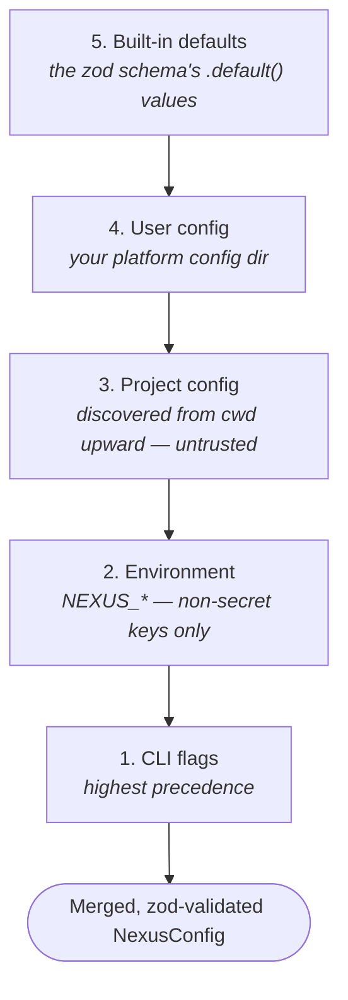
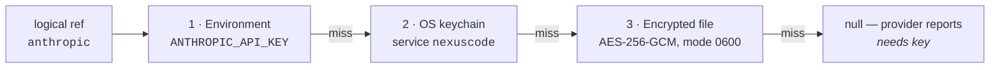

# Configuration

NexusCode's configuration is loaded with [cosmiconfig](https://github.com/cosmiconfig/cosmiconfig)
and validated with [zod](https://zod.dev). Every key in this document is taken from the
schema in `packages/config/src/schema.ts`; every default is the schema's own default.

Two rules govern the whole system:

1. **Credentials are never configuration.** A config file holds only *logical
   references* (`apiKeyRef`, `apiKeyEnv`, `secretRef`, `bearerRef`). Actual key values
   live in the [SecretStore](#secrets), and are masked wherever they surface.
2. **Project config is untrusted.** A config file that ships inside a cloned repository
   cannot make NexusCode spawn a process or import a module. See
   [Workspace trust](#workspace-trust-what-project-config-cannot-do).

---

## Quick start

```bash
nexus config path              # the file the CLI writes to
nexus config get               # the fully merged, validated config as JSON
nexus config get tui.theme     # one dotted key
nexus config set tui.panes 4   # validated against the schema before writing
```

`nexus config set` validates the whole resulting document against the schema *before*
touching disk, so a typo fails loudly instead of bricking later commands.

---

## Precedence

Layers are deep-merged lowest to highest. **Arrays replace; they do not concatenate** —
a project-level `routing` array fully overrides the user-level one. `undefined` values
are ignored.



Reading top to bottom in the diagram: each layer overrides the one above it, and CLI
flags win over everything.

The loader reports which layers actually contributed data, plus the resolved project and
user file paths, so `nexus doctor` and `nexus config get` can tell you where a value came
from.

### Unknown keys never break you

If the merged config contains keys the schema does not recognize — a typo, or a key from
an older version — those keys are stripped, a warning is written to stderr, and loading
continues with the valid subset plus defaults. Only genuinely unusable data (a wrong
*type* on a known key) is a hard error.

---

## Where config lives

### User config

Resolved with [`env-paths`](https://github.com/sindresorhus/env-paths) using the app
name `nexuscode` and no suffix:

| Platform | Config dir | Data dir | Cache dir |
| --- | --- | --- | --- |
| **macOS** | `~/Library/Preferences/nexuscode` | `~/Library/Application Support/nexuscode` | `~/Library/Caches/nexuscode` |
| **Linux** | `$XDG_CONFIG_HOME/nexuscode` (default `~/.config/nexuscode`) | `$XDG_DATA_HOME/nexuscode` (default `~/.local/share/nexuscode`) | `$XDG_CACHE_HOME/nexuscode` (default `~/.cache/nexuscode`) |
| **Windows** | `%APPDATA%\nexuscode\Config` | `%LOCALAPPDATA%\nexuscode\Data` | `%LOCALAPPDATA%\nexuscode\Cache` |

Inside the config dir, the loader tries these filenames **in order** and uses the first
one that exists and is non-empty:

1. `config.yaml`
2. `config.yml`
3. `config.json`
4. `.nexusrc`
5. `.nexusrc.json`

A file that is present but malformed is a hard error — it is not silently skipped.

> The CLI itself always **writes** to `config.json` in that directory (`nexus config
> set`, `nexus providers add`, `nexus plugin add`, `nexus budget set`). Hand-written YAML
> is read fine, but the CLI will not edit it in place — check `nexus config path` to see
> the file the CLI owns.

Override the directory with `NEXUS_CONFIG_DIR`.

### Project config

Discovered by cosmiconfig searching upward from the current directory, stopping at the
project root (`searchStrategy: "project"`). Search places, in cosmiconfig's order:

```
package.json                 ← the "nexuscode" property
.nexuscoderc
.nexuscoderc.json
.nexuscoderc.yaml
.nexuscoderc.yml
.nexuscoderc.js
.nexuscoderc.ts
.nexuscoderc.cjs
.nexuscoderc.mjs
.config/nexuscoderc
.config/nexuscoderc.json
.config/nexuscoderc.yaml
.config/nexuscoderc.yml
.config/nexuscoderc.js
.config/nexuscoderc.ts
.config/nexuscoderc.cjs
.config/nexuscoderc.mjs
nexuscode.config.js
nexuscode.config.ts
nexuscode.config.cjs
nexuscode.config.mjs
```

For a checked-in project config, `.nexuscoderc.json` or `.nexuscoderc.yaml` is the
straightforward choice. Note that `nexuscode.config.json` is **not** in the list — the
`nexuscode.config.*` family is JavaScript/TypeScript only.

### Workspace trust: what project config *cannot* do

A project config file arrives with a cloned repository, so it is treated as untrusted
input. Before it is merged, these fields are stripped or forced, and a warning naming
each dropped field is written to stderr:

| Field | What happens | Why |
| --- | --- | --- |
| `lsp.servers` | dropped | each entry is a `{command, args}` launch recipe |
| `mcp[]` entries with a `command` | dropped (stdio servers only; remote entries survive) | spawns a local MCP server process |
| `providers[]` entries with a `command` | dropped | subprocess adapters spawn a local binary |
| `hooks.hooks` | dropped (the `hooks.enabled` toggle survives) | each command hook spawns a child on a lifecycle event |
| `plugins.dirs` | dropped | causes arbitrary local modules to be imported |
| `plugins.scanNodeModules` | forced to `false` | same |

Everything non-executable — routing, pricing, budgets, tool allow/deny, RAG settings —
merges normally. If you want any of the stripped settings, put them in your **user**
config, where you are the author.

---

## Configuration keys

### Top level

| Key | Type | Default | Meaning |
| --- | --- | --- | --- |
| `defaultProvider` | string | `"anthropic"` | Provider used when no `-p` is given. Falls back to a usable provider (`mock` first) if this one has no credential. |
| `defaultModel` | string | *(unset)* | Model used when no `-m` is given. Unset means the provider's first model. |
| `providers` | `ProviderConfig[]` | `[]` | Extra/overriding provider entries. Entries here win over the built-in catalog. |
| `mcp` | `McpServerConfig[]` | `[]` | MCP servers connected and tool-discovered at session startup. |
| `routing` | `RouteRule[]` | `[]` | Declarative routing rules. |
| `approval` | `"auto"` \| `"confirm"` \| `"dry-run"` | `"confirm"` | Default approval posture for tool execution. |
| `pricing` | `Record<string, PricingEntry>` | `{}` | Model id → USD per 1M tokens. Overrides the built-in table. |
| `latency` | `Record<string, number>` | `{}` | Model / provider / `"provider/model"` id → estimated latency in ms. Used by `optimize: "latency"`. |
| `quality` | `string[]` | `[]` | Quality ranking, best first, of model / provider / `"provider/model"` ids. Used by `optimize: "quality"`. |

The remaining top-level keys are objects, each documented in its own section below:
`tui`, `history`, `observability`, `rag`, `cache`, `fileintel`, `agent`, `tasks`,
`terminal`, `gemini`, `bedrock`, `vertex`, `lsp`, `tools`, `hooks`, `webhooks`,
`plugins`, `enterprise`, `performance`, `auth`.

### `providers[]` — `ProviderConfig`

Objects are strict: an unrecognized field is stripped with a warning.

| Key | Type | Default | Meaning |
| --- | --- | --- | --- |
| `id` | string | *required* | Provider id you pass to `-p`. |
| `kind` | `"openai-compat"` \| `"anthropic"` \| `"gemini"` \| `"bedrock"` \| `"vertex"` \| `"subprocess"` \| `"mock"` | *required* | Selects the adapter family. |
| `adapter` | string | *required* | Provider package name, e.g. `"@nexuscode/provider-openai"`. |
| `baseUrl` | URL string | *(unset)* | Endpoint override. This is how `ollama`, `grok`, and self-hosted OpenAI-compatible servers are configured. |
| `apiKeyRef` | string | *(unset)* | Logical SecretStore reference. Defaults to `id` when unset. |
| `apiKeyEnv` | string | *(unset)* | Environment variable read for the key, e.g. `"XAI_API_KEY"`. Checked before the SecretStore. |
| `modelMap` | `Record<string, string>` | `{}` | Logical alias → native model id. |
| `models` | `string[]` | `[]` | Static model list; usually left empty and probed at runtime. |
| `command` | string | *(unset)* | Subprocess adapters only, e.g. `"claude"`. **Ignored in project config.** |
| `flags` | `Record<string, string>` | *(unset)* | Adapter-specific knobs. Bedrock reads `region`; Vertex reads `project` and `location`. |
| `timeoutMs` | positive int | `120000` | Per-request timeout. |
| `maxRetries` | int >= 0 | `2` | Retry budget. |
| `concurrency` | positive int | `4` | Max in-flight requests. |

### `routing[]` — `RouteRule`

| Key | Type | Default | Meaning |
| --- | --- | --- | --- |
| `when.capability` | `"chat"` \| `"code-edit"` \| `"shell"` \| `"vision"` \| `"embed"` | *(unset)* | Match on required capability. |
| `when.tag` | string | *(unset)* | Match on a caller-supplied tag. |
| `use` | string | *required* | Primary target: `"anthropic/claude-sonnet"` or `"claude-code"`. |
| `fallback` | `string[]` | `[]` | Last-resort candidates appended after the optimized set. |
| `optimize` | `"quality"` \| `"cost"` \| `"latency"` \| `"local"` | `"quality"` | Ordering axis for candidates. |

> `nexus route explain --optimize <axis>` also accepts `explicit`, which orders by the
> `--allow` list you pass on the command line. That axis is a CLI-only affordance; the
> four values above are what a config rule may declare.

### `tui`

| Key | Type | Default | Meaning |
| --- | --- | --- | --- |
| `theme` | `"dark"` \| `"light"` \| `"auto"` | `"auto"` | Light/dark preference. |
| `panes` | int 1–6 | `3` | Pane count in the pane-tree layout. |

> This is *not* the named-palette setting. The 16 signature palettes (`nexus-noir`,
> `paper-nexus`, …) are chosen per invocation with `nexus tui --theme <name>`.

### `history`

| Key | Type | Default | Meaning |
| --- | --- | --- | --- |
| `enabled` | boolean | `true` | Record runs to the SQLite event log. |
| `dbPath` | string | *(data dir)* `history.db` | Database location. |

### `observability`

| Key | Type | Default | Meaning |
| --- | --- | --- | --- |
| `enabled` | boolean | `true` | Instrument the engine with spans + metrics. |
| `exporter` | `"file"` \| `"memory"` \| `"otlp"` \| `"none"` | `"file"` | Where finished spans go. `file` is offline NDJSON; `none` still aggregates in-process metrics. |
| `filePath` | string | *(data dir)* `traces.ndjson` | NDJSON span file. |
| `otlpEndpoint` | URL string | *(unset)* | OTLP/HTTP traces endpoint for the `otlp` exporter. |

### `rag`

| Key | Type | Default | Meaning |
| --- | --- | --- | --- |
| `enabled` | boolean | `false` | Enable retrieval into assembled context. `nexus index` / `nexus search` work regardless. |
| `embedder` | `"hashing"` \| `"ollama"` \| `"openai"` \| `"provider"` | `"hashing"` | `hashing` is deterministic and fully offline. |
| `embedderModel` | string | *(unset)* | Model id for the remote embedders. Ignored by `hashing`. |
| `embedderProvider` | string | *(unset)* | Provider id backing the `provider` embedder. Falls back to `hashing` if it has no embeddings support. |
| `dims` | positive int | `512` | Vector dimensionality for the hashing embedder. |
| `topK` | positive int | `5` | Chunks retrieved per query. |
| `storeFile` | string | *(data dir)* `rag-index.json` | Persisted index location. |
| `chunkSize` | positive int | `800` | Target chunk size in characters. |
| `overlap` | int >= 0 | `100` | Characters carried between consecutive chunks. |
| `ignore` | `string[]` | `[]` | Extra gitignore-style globs to skip. |
| `secretScan` | boolean | `true` | Redact detected secrets from chunk text before embedding or persisting. A secret-*file* denylist (`.env`, `*.pem`, `id_rsa`, …) always applies regardless. |
| `maxTotalBytes` | positive int | `134217728` (128 MiB) | Aggregate byte budget for one indexing run. Truncation is reported on stderr. |
| `maxTotalChunks` | positive int | `100000` | Aggregate chunk cap for one indexing run. |
| `embedBatchSize` | positive int | `128` | Chunks embedded per batch; bounds peak memory. |

### `cache`

| Key | Type | Default | Meaning |
| --- | --- | --- | --- |
| `enabled` | boolean | `false` | Master switch for the response-cache short-circuit. |
| `dir` | string | *(platform cache dir)* | Cache directory. Also settable via `NEXUS_CACHE_DIR`. |
| `ttlMs` | positive int | *(unset — no expiry)* | TTL for cached entries. |
| `backend` | `"memory"` \| `"disk"` | `"disk"` | `disk` survives restarts. |
| `responses` | boolean | `true` | Cache model responses for identical requests. |
| `embeddings` | boolean | `true` | Memoize embedding vectors by `(model, text)`. |
| `affinity` | boolean | `true` | Prefer a session's last provider so its prompt cache stays warm. Failover still applies. |

### `fileintel`

| Key | Type | Default | Meaning |
| --- | --- | --- | --- |
| `repoMap` | boolean | `false` | Enable the structural repo-map context source. |
| `budgetTokens` | positive int | `1024` | Token budget for the rendered repo map. |
| `maxFiles` | positive int | *(unset)* | Hard cap on files returned by the walker. |
| `ignore` | `string[]` | `[]` | Extra gitignore-style globs. |
| `maxTotalFiles` | positive int | `20000` | Aggregate file cap applied when `maxFiles` is unset. |
| `maxTotalBytes` | positive int | `134217728` (128 MiB) | Aggregate byte budget across a walk. |

### `agent`

| Key | Type | Default | Meaning |
| --- | --- | --- | --- |
| `defaultRole` | `coordinator` \| `planner` \| `coder` \| `reviewer` \| `tester` \| `researcher` \| `architect` \| `doc-writer` \| `security-reviewer` | `"coordinator"` | Role when `--role` is omitted. |
| `maxSteps` | positive int | `12` | Cap on OODA iterations per run. |
| `maxRetries` | int >= 0 | `2` | Self-correction retry budget per failed step. |
| `maxTurnsPerStep` | positive int | `8` | Provider re-invocations inside one step's tool loop. |

### `tasks`

| Key | Type | Default | Meaning |
| --- | --- | --- | --- |
| `persist` | boolean | `true` | Persist the task DAG to disk. `false` keeps it in memory. |
| `file` | string | *(data dir)* `tasks.json` | Durable task store location. |

### `terminal`

| Key | Type | Default | Meaning |
| --- | --- | --- | --- |
| `shell` | string | `$SHELL`, else `/bin/sh` | Interactive shell for `nexus jobs pty`. |
| `pty` | `"auto"` \| `"child_process"` \| `"node-pty"` | `"auto"` | `auto` prefers `node-pty` when installed and degrades to `child_process`. |
| `maxOutputBytes` | positive int | `8388608` (8 MiB) | Combined stdout+stderr cap before a background job is killed. |
| `historySize` | positive int | `1000` | Retained command-history entries. |
| `maxConcurrentJobs` | positive int | `8` | Ceiling on live background jobs. Fork-bomb guard. |
| `maxJobRuntimeMs` | positive int | `600000` (10 min) | Per-job wall-clock timeout; overruns are SIGTERMed then SIGKILLed. |

### `gemini`, `bedrock`, `vertex`

These three configure the always-present native cloud providers. `enabled: false`
removes the provider from the catalog entirely.

**`gemini`**

| Key | Type | Default |
| --- | --- | --- |
| `enabled` | boolean | `true` |
| `apiKeyEnv` | string | `"GEMINI_API_KEY"` |
| `modelMap` | `Record<string, string>` | `{ "gemini-flash": "gemini-2.0-flash", "gemini-pro": "gemini-1.5-pro" }` |

**`bedrock`**

| Key | Type | Default |
| --- | --- | --- |
| `enabled` | boolean | `true` |
| `region` | string | *(unset — the AWS SDK's own resolution chain applies)* |
| `modelMap` | `Record<string, string>` | `{ "bedrock-sonnet": "anthropic.claude-3-5-sonnet-20241022-v2:0", "bedrock-nova": "amazon.nova-pro-v1:0" }` |

**`vertex`**

| Key | Type | Default |
| --- | --- | --- |
| `enabled` | boolean | `true` |
| `project` | string | *(unset — resolved from ADC / `GOOGLE_CLOUD_PROJECT`)* |
| `location` | string | `"us-central1"` |
| `modelMap` | `Record<string, string>` | `{ "vertex-flash": "gemini-2.0-flash", "vertex-pro": "gemini-1.5-pro" }` |

### `lsp`

| Key | Type | Default | Meaning |
| --- | --- | --- | --- |
| `enabled` | boolean | `true` | Enable the LSP-backed tools and `nexus lsp`. |
| `servers` | `LspServerSpec[]` | `[]` | Extra launch recipes alongside the built-in registry. **Ignored in project config.** |
| `timeoutMs` | positive int | `5000` | Budget for one LSP request. |

Each `LspServerSpec`: `language` (required), `languageId` (required), `command`
(required), `args` (default `[]`), `extensions` (default `[]`), `rootMarkers` (default
`[]`), `label` (optional).

### `tools`

| Key | Type | Default | Meaning |
| --- | --- | --- | --- |
| `enabledGroups` | array of `"web"` \| `"browser"` \| `"db"` \| `"cloud"` \| `"containers"` \| `"ai"` | `[]` | Tool groups registered into the agent loop. Opt-in — nothing extra is registered by default. |
| `allow` | `string[]` | `[]` | Tool-name glob patterns pre-approved by the permission gate. |
| `deny` | `string[]` | `[]` | Tool-name glob patterns always denied. **Deny wins over allow.** |
| `web.searchProvider` | `"mock"` \| `"http"` | `"mock"` | Backend for `web_search`. `mock` is deterministic and offline. |
| `web.searchApiKeyEnv` | string | *(unset)* | Env var holding the `http` search key — never the value. |
| `web.searchApiKeyRef` | string | *(unset)* | SecretStore ref for the `http` search key. |
| `web.ssrfAllowlist` | `string[]` | `[]` | Extra hostnames allowed past the SSRF guard. Private and loopback addresses stay blocked otherwise. |
| `web.defaultMaxResults` | positive int | *(unset)* | Default result count for `web_search`. |
| `db.connections` | `Record<string, DbConnection>` | `{}` | Named connections usable as `nexus tools run db_query --connection <name>`. |

A `db.connections` entry takes `driver` (one of `sqlite`, `postgres`, `mysql`,
`snowflake`, `bigquery`) plus any of `file`, `readonly`, `connectionString`, `host`,
`port`, `user`, `password`, `database`, `ssl`, `account`, `warehouse`, `role`, `schema`,
`projectId`, `keyFilename`, `location`.

> `password` is accepted for convenience but should come from the environment. This
> cascade is merged and frequently shared — do not commit a live password to it.

### `hooks`

| Key | Type | Default | Meaning |
| --- | --- | --- | --- |
| `enabled` | boolean | `true` | Master switch. `false` registers no command hooks. |
| `hooks` | `CommandHook[]` | `[]` | Declared command hooks. **Ignored in project config.** |

A `CommandHook`:

| Key | Type | Default | Meaning |
| --- | --- | --- | --- |
| `event` | one of the ten lifecycle events | *required* | `session-start`, `session-end`, `pre-run`, `post-run`, `pre-tool`, `post-tool`, `pre-agent-step`, `post-agent-step`, `on-error`, `on-approval`. |
| `command` | string | *required* | Executable, resolved against `PATH`. |
| `args` | `string[]` | `[]` | Arguments. |
| `matcher` | string | *(unset)* | Tool-name glob scoping `pre-tool` / `post-tool`. |
| `timeoutMs` | positive int | `5000` | Overrunning children are killed and treated as a block. |
| `env` | `Record<string, string>` | `{}` | Extra, non-secret env for the child. |
| `failOpen` | boolean | `false` | On veto-capable events, a hook that fails to run denies by default. `true` restores fail-open. |

The hook receives the event payload as JSON on stdin. On a `pre-*` event, stdout
`{block, reason, modify}` or a non-zero exit can veto or modify the operation.

### `webhooks[]`

| Key | Type | Default | Meaning |
| --- | --- | --- | --- |
| `url` | URL string | *required* | Destination. |
| `events` | array of lifecycle event names, min 1 | *required* | Which events trigger a POST. |
| `secretRef` | string | *(unset)* | SecretStore ref for the HMAC signing secret — never the value. |
| `enabled` | boolean | `true` | Disable without deleting. |
| `timeoutMs` | positive int | `5000` | Per-attempt timeout. |
| `maxRetries` | int >= 0 | `2` | Retries on transient failure. |
| `ssrfAllowlist` | `string[]` | `[]` | Exact hostnames/IP literals allowed past the private/loopback block. |
| `allowPrivate` | boolean | `false` | Permit private/loopback targets outright. |

Payloads are JSON, HMAC-signed, and secret-redacted before sending.

### `plugins`

| Key | Type | Default | Meaning |
| --- | --- | --- | --- |
| `enabled` | boolean | `true` | Master switch for discovery and loading. |
| `dirs` | `string[]` | `[]` | Extra directories whose immediate subdirectories are each a plugin. **Ignored in project config.** |
| `scanNodeModules` | boolean | `true` | Also scan installed `nexuscode-plugin-*` packages. **Forced to `false` in project config.** |

### `enterprise`

Off by default. `mode: "off"` leaves single-user behaviour completely unchanged — no
authorization check, no budget gate, no audit.

| Key | Type | Default | Meaning |
| --- | --- | --- | --- |
| `mode` | `"off"` \| `"on"` | `"off"` | Master switch. |
| `defaultRole` | string | `"default"` | Role for a principal naming no known role. |
| `roles` | `EnterpriseRole[]` | `[]` | Custom roles merged over the built-ins (`admin`, `developer`, `viewer`, `default`). Each: `name`, `grants[]` (`{actions[], resources[]}`), optional `inherits[]`. |
| `principals` | `EnterprisePrincipal[]` | `[]` | Directory of `{id, roles[], token?}`. The bearer token authenticates to the REST daemon and is never logged. |
| `policies` | `EnterprisePolicyRule[]` | `[]` | Deny-overrides rules: `{effect, subjects?, actions?, resources?, conditions?, description?, id?}`. |
| `budgets` | `EnterpriseBudget[]` | `[]` | `{id, scope: principal\|role\|org, key, limitUsd, window: run\|day\|month, warnThreshold?, onExceed?: deny\|downgrade, downgradeTo?}`. |
| `gateways` | `{global?, byProvider?}` | *(unset)* | Private model gateways. Each: `{baseUrl, headers?, overrideProviderHeaders?, egressAllowlist?}`. |
| `audit.file` | string | *(data dir)* | Hash-chained, append-only NDJSON audit log. |
| `defaultPrincipal` | string | *(unset)* | Principal a CLI run is attributed to when none is given. |

### `performance`

| Key | Type | Default | Meaning |
| --- | --- | --- | --- |
| `pool.maxSockets` | positive int | `64` | Max concurrent sockets per host, applied process-wide before any adapter is built. |
| `pool.maxFreeSockets` | positive int | `16` | Idle sockets kept warm per host. |
| `pool.keepAliveMsecs` | positive int | `1000` | How long an idle keep-alive socket lingers. |
| `lazy` | boolean | `true` | Defer heavy subsystem construction to first use. `false` builds everything eagerly at bootstrap — useful for a long-lived daemon. |
| `background` | boolean | `false` | Default `nexus index` to a detached background reindex. |
| `watch.debounceMs` | positive int | `150` | Debounce before a watch-mode reindex fires. |
| `watch.prune` | boolean | `false` | Remove documents whose files vanished, on each incremental reindex. |

### `auth`

| Key | Type | Default | Meaning |
| --- | --- | --- | --- |
| `tokenStore` | `"auto"` \| `"keychain"` \| `"file"` | `"auto"` | Where OAuth tokens are persisted. `auto` prefers the OS keychain but degrades to the encrypted file when a keychain prompt would block a headless context. |
| `providers` | `Record<string, AuthProviderOverride>` | `{}` | Per-provider overrides, keyed by provider id. |

Each `AuthProviderOverride` — every field optional and additive:

| Key | Type | Meaning |
| --- | --- | --- |
| `method` | `"oauth"` \| `"api-key"` \| `"cli-delegate"` \| `"cloud-sso"` | Pin the login method. |
| `mode` | `"browser"` \| `"device"` \| `"auto"` | OAuth flow mode. |
| `clientId` | string | Override the OAuth client id (enterprise / self-hosted). |
| `authorizeUrl` | URL string | Override the authorize endpoint. |
| `tokenEndpoint` | URL string | Override the token endpoint. |
| `deviceEndpoint` | URL string | Override the device-authorization endpoint. |
| `scopes` | `string[]` | Override the requested scopes. |
| `openBrowserOnLogin` | boolean | Auto-open a browser to the key page during a guided api-key login. Equivalent to `--open`. Default off: the URL is printed. |

No secret is ever stored here. Tokens live only in the SecretStore.

### `mcp[]`

| Key | Type | Default | Meaning |
| --- | --- | --- | --- |
| `name` | string | *required* | Unique server id; also the discovered-tool namespace. |
| `transport` | `"stdio"` \| `"sse"` \| `"http"` | *required* | Transport family. |
| `enabled` | boolean | `true` | Disable without deleting. |
| `trustAnnotations` | boolean | `false` | Trust the server's `readOnlyHint` enough to downgrade a tool's permission class. MCP annotations are self-declared and untrusted by spec — only enable for servers you actually trust. |
| `command` | string | *(unset)* | Required for `stdio`. **Ignored in project config.** |
| `args` | `string[]` | `[]` | stdio argv. |
| `env` | `Record<string, string>` | `{}` | stdio child environment. |
| `url` | URL string | *(unset)* | Required for `sse` / `http`. |
| `auth.bearerRef` | string | *(unset)* | SecretStore ref resolved into `Authorization: Bearer` at connect time. |
| `auth.headerRefs` | `Record<string, string>` | `{}` | Header name → SecretStore ref. |
| `auth.headers` | `Record<string, string>` | `{}` | Static, non-secret headers. |
| `timeoutMs` | positive int | *(unset)* | Per-request override. |

### `pricing` entries

| Key | Type | Meaning |
| --- | --- | --- |
| `inputPer1M` | number >= 0 | USD per 1M input tokens. |
| `outputPer1M` | number >= 0 | USD per 1M output tokens. |
| `cacheReadPer1M` | number >= 0 | Optional. |
| `cacheWritePer1M` | number >= 0 | Optional. |
| `reasoningPer1M` | number >= 0 | Optional. |

A built-in table already prices the common Anthropic models so cost accounting works out
of the box; `pricing` overrides any entry. An unknown model id contributes `$0` rather
than a made-up number.

---

## A full annotated example

User config, `<config dir>/config.json`:

```jsonc
{
  // ── Defaults ──────────────────────────────────────────────────────────────
  "defaultProvider": "anthropic",
  "defaultModel": "claude-sonnet-4-5",
  "approval": "confirm",              // auto | confirm | dry-run

  // ── Extra providers ───────────────────────────────────────────────────────
  // The built-in catalog already registers groq, together, deepseek, mistral,
  // openrouter, nvidia, lmstudio, vllm, azure-openai, gemini, bedrock, vertex,
  // claude-code, codex, and the mock family. Add the ones it does not.
  "providers": [
    {
      "id": "openai",
      "kind": "openai-compat",
      "adapter": "@nexuscode/provider-openai",
      "apiKeyEnv": "OPENAI_API_KEY"
    },
    {
      // Local models. `ollama` is auto-detected as local: no key, zero cost.
      // Every `openai-compat` entry rides the shared transport in
      // @nexuscode/provider-openai; only baseUrl and pricing differ.
      "id": "ollama",
      "kind": "openai-compat",
      "adapter": "@nexuscode/provider-openai",
      "baseUrl": "http://localhost:11434/v1",
      "modelMap": { "local-fast": "llama3.2", "local-big": "qwen2.5-coder:32b" }
    },
    {
      "id": "grok",
      "kind": "openai-compat",
      "adapter": "@nexuscode/provider-openai",
      "baseUrl": "https://api.x.ai/v1",
      "apiKeyEnv": "XAI_API_KEY"
    }
  ],

  // ── Routing ───────────────────────────────────────────────────────────────
  // Rules are evaluated against the request; `optimize` orders the survivors and
  // `fallback` is appended as a last resort. Failover is live: a candidate that
  // fails before emitting real output is retried down the chain.
  "routing": [
    {
      "when": { "capability": "code-edit" },
      "use": "claude-code",
      "fallback": ["anthropic/claude-sonnet-4-5", "openai/gpt-4o"],
      "optimize": "quality"
    },
    {
      "when": { "tag": "bulk" },
      "use": "ollama",
      "fallback": ["groq/llama-3.1-8b-instant"],
      "optimize": "local"      // local providers first, then cheapest
    }
  ],

  // ── Cost, latency, quality metadata for the router ────────────────────────
  "pricing": {
    "gpt-4o": { "inputPer1M": 2.5, "outputPer1M": 10 }
  },
  "latency": { "ollama": 120, "groq": 200 },
  "quality": ["claude-opus-4-1", "gpt-4o", "claude-sonnet-4-5"],

  // ── Terminal UI ───────────────────────────────────────────────────────────
  "tui": { "theme": "auto", "panes": 3 },

  // ── Retrieval ─────────────────────────────────────────────────────────────
  // `hashing` is offline and deterministic — no key, no network, no data leaves
  // the machine. Switch to `openai`/`ollama` only if you want remote embeddings.
  "rag": {
    "enabled": true,
    "embedder": "hashing",
    "topK": 8,
    "secretScan": true,
    "ignore": ["dist/**", "**/*.min.js"]
  },

  // ── Structural context ────────────────────────────────────────────────────
  "fileintel": { "repoMap": true, "budgetTokens": 2048 },

  // ── Caching ───────────────────────────────────────────────────────────────
  "cache": { "enabled": true, "backend": "disk", "ttlMs": 86400000 },

  // ── Tool groups (opt-in; nothing extra is registered by default) ──────────
  "tools": {
    "enabledGroups": ["web", "db"],
    "deny": ["shell_exec"],            // deny always wins over allow
    "web": { "searchProvider": "mock", "ssrfAllowlist": ["internal.example.com"] },
    "db": {
      "connections": {
        "local": { "driver": "sqlite", "file": "./app.db", "readonly": true }
      }
    }
  },

  // ── MCP servers ───────────────────────────────────────────────────────────
  // stdio entries are honoured only from USER config, never from a repo's config.
  "mcp": [
    {
      "name": "fs",
      "transport": "stdio",
      "command": "npx",
      "args": ["-y", "@modelcontextprotocol/server-filesystem", "."]
    },
    {
      "name": "gh",
      "transport": "http",
      "url": "https://mcp.example.com",
      "auth": { "bearerRef": "gh-mcp" }   // a SecretStore ref, not a token
    }
  ],

  // ── Auth ──────────────────────────────────────────────────────────────────
  "auth": {
    "tokenStore": "auto",
    "providers": {
      "anthropic": { "method": "api-key" }   // skip the experimental OAuth flow
    }
  },

  // ── Observability ─────────────────────────────────────────────────────────
  "observability": { "enabled": true, "exporter": "file" },

  // ── Performance ───────────────────────────────────────────────────────────
  "performance": {
    "lazy": true,
    "pool": { "maxSockets": 64, "maxFreeSockets": 16, "keepAliveMsecs": 1000 }
  }
}
```

Notice what is *not* in that file: no API keys, no OAuth tokens, no bearer tokens. Only
`apiKeyEnv` and `bearerRef` references.

> The example uses JSONC comments for readability. Strict `config.json` does not accept
> comments — strip them, or use `config.yaml`, which does.

A project-level `.nexuscoderc.json` is usually much smaller:

```json
{
  "defaultProvider": "ollama",
  "rag": { "ignore": ["fixtures/**"] },
  "tools": { "deny": ["shell_exec", "browser_*"] }
}
```

---

## Secrets

Config never holds a key value. Every credential resolves through the **SecretStore
chain**, which tries three backends in order and returns the first hit:



**1 · Environment.** A logical ref maps to an environment variable name by
upper-casing it, replacing every run of non-alphanumeric characters with `_`, and
appending `_API_KEY`. So the ref `anthropic` reads `ANTHROPIC_API_KEY`, and
`azure-openai` reads `AZURE_OPENAI_API_KEY`. A `providers[]` entry can name a different
variable explicitly with `apiKeyEnv`. This backend is what makes CI and Docker work with
no keychain and no vault file.

**2 · OS keychain.** Uses `@napi-rs/keyring` under the service name `nexuscode`. It is
an optional native dependency: if it is not installed, or the platform has no usable
keychain (common in headless and sandboxed environments), the chain silently moves on
rather than failing.

**3 · Encrypted file.** A vault at `<data dir>/secrets.enc.json`, written with mode
`0600`. Each entry is AES-256-GCM with a per-entry random salt and IV; the key is
derived with scrypt from `NEXUS_VAULT_PASSPHRASE`. Without that variable set, this
backend can read nothing and refuses to write.

Writes go to the highest available *durable* backend: the keychain if it works,
otherwise the encrypted file. The environment is read-only — NexusCode never sets
variables on your behalf. Deletes clear every writable backend.

### Storing and inspecting credentials

```bash
nexus login <provider>        # recommended — runs the provider's real auth flow
nexus login                   # pick a provider interactively
nexus auth status             # who is signed in, by what method, expiring when
nexus logout <provider>       # clear stored tokens; --all for every provider

nexus keys set <ref>          # prompts on a TTY; also accepts a value or --stdin
nexus keys list               # every known ref, its backend, and a masked value
nexus keys test <provider>    # run the adapter's health probe with the resolved key
```

`nexus login` is the preferred path: it runs OAuth where the provider offers it, the
vendor CLI's own login for wrapped CLIs, the cloud SSO chain for AWS, and a guided
key capture where the provider genuinely authenticates by key. `nexus keys set` is the
lower-level escape hatch for a raw API key.

### Masking

Any value that reaches a log, trace, or terminal is reduced to
`<recognized-prefix>…<last4>` — for example `sk-ant-…F3k2`. Recognized prefixes include
`sk-ant-`, `sk-`, `xai-`, `gsk_`, `AIza`, `ghp_`, and `key-`. A value of 8 characters or
fewer collapses to `…` entirely. Secrets are never written to the SQLite history or the
trace store, and webhook payloads are redacted before being sent.

---

## Environment variables

### Config overrides

These map directly onto config keys as layer 2 of the cascade. They are deliberately
limited to non-secret settings.

| Variable | Sets | Accepted values |
| --- | --- | --- |
| `NEXUS_DEFAULT_PROVIDER` | `defaultProvider` | any provider id |
| `NEXUS_DEFAULT_MODEL` | `defaultModel` | any model id |
| `NEXUS_APPROVAL` | `approval` | `auto`, `confirm`, `dry-run` |
| `NEXUS_HISTORY_DB` | `history.dbPath` | a path |
| `NEXUS_HISTORY_DISABLED` | `history.enabled = false` | `1` or `true` |

### Paths and storage

| Variable | Effect |
| --- | --- |
| `NEXUS_CONFIG_DIR` | Directory the CLI reads and writes user config in. |
| `NEXUS_DATA_DIR` | Data directory: memory, tasks, RAG index, traces, command history, audit log, plugins. |
| `NEXUS_CACHE_DIR` | Cache directory. `cache.dir` in config takes precedence. |
| `NEXUS_TRACE_FILE` | NDJSON span file. `observability.filePath` takes precedence. |
| `NEXUS_PLUGINS_DIR` | An extra plugin search directory. |

### Credentials

| Variable | Effect |
| --- | --- |
| `NEXUS_VAULT_PASSPHRASE` | Passphrase for the encrypted-file secret backend. Without it, that backend cannot read or write. |
| `<REF>_API_KEY` | Per-provider key, derived from the logical ref — `ANTHROPIC_API_KEY`, `OPENAI_API_KEY`, `GROQ_API_KEY`, and so on. See [PROVIDERS.md](./PROVIDERS.md) for the per-provider list. |
| `NEXUS_GOOGLE_OAUTH_CLIENT_SECRET` | Override the public `gcloud` installed-app client secret used by the Google OAuth flow. |

### Provider binaries

| Variable | Effect |
| --- | --- |
| `NEXUS_CLAUDE_CODE_BIN` | Path to the `claude` binary for the `claude-code` provider. |
| `NEXUS_CODEX_BIN` | Path to the `codex` binary for the `codex` provider. |

### Enterprise

| Variable | Effect |
| --- | --- |
| `NEXUS_PRINCIPAL` | Principal a CLI run is attributed to. Overridden by an explicit flag; falls back to `enterprise.defaultPrincipal`. |

### Terminal and accessibility

| Variable | Effect |
| --- | --- |
| `NEXUS_FORCE_TUI` | Truthy forces the rich TUI even on a non-TTY, `TERM=dumb`, or narrow terminal. |
| `NEXUS_PLAIN` | Truthy disables colour (attributes only). |
| `NEXUS_COLOR` | `off` disables colour. |
| `NEXUS_ASCII` | Truthy forces ASCII-only glyphs. |
| `NEXUS_MOUSE` | Truthy enables mouse support in the TUI. |
| `NEXUS_MOTION` | `none` disables animation. |
| `NEXUS_REDUCED_MOTION` | Truthy disables animation. |
| `NEXUS_SCREEN_READER` | Truthy enables screen-reader-friendly output. |

Standard variables are respected too: `NO_COLOR` and `ACCESSIBLE` disable colour and
enable screen-reader mode respectively, and `TERM` / `COLORTERM` drive capability
detection.

---

## Verifying your configuration

```bash
nexus config path      # which file the CLI writes
nexus config get       # the merged, validated result — the real answer
nexus doctor           # config dir, history db, providers, auth, every subsystem
nexus providers list   # the live catalog with credential status
```

If a setting appears to be ignored, the likely causes, in order of frequency:

1. **Arrays replace.** A higher layer's array wholly overrides a lower one.
2. **A higher layer wins.** An environment variable or CLI flag beats your file.
3. **Workspace trust stripped it.** Executable fields in a *project* config are dropped
   with a warning on stderr. Move them to user config.
4. **The key was unrecognized.** Unknown keys are stripped with a warning; check stderr.

---

## See also

- **[GETTING-STARTED.md](./GETTING-STARTED.md)** — install and first run.
- **[PROVIDERS.md](./PROVIDERS.md)** — per-provider auth, env vars, and config snippets.
- **[COMMANDS.md](./COMMANDS.md)** — the complete command reference.
